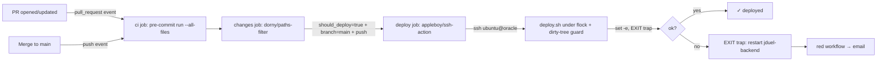

# feat: Auto-deploy on Merge to Main (Oracle VPS via GitHub Actions SSH)

## Summary

Wire a single-file GitHub Actions pipeline (one workflow, two jobs: `ci` then `deploy`) that, on every merge to `main`, runs the existing pre-commit suite and — on green and only when production-relevant files changed — SSHes into the Oracle VPS as the existing `ubuntu` user and runs the existing `deploy.sh`. The pipeline reuses the deploy script and systemd unit unchanged in behavior; the new work is the GHA wiring, a hardened unattended mode for `deploy.sh` (`flock`, post-failure backend-restart trap, dirty-tree guard, explicit `--dry-run`), GitHub branch protection on `main`, scoped sudoers + deploy SSH key on the box, and a docs update.

---

## Problem Frame

Production deploys today are a manual SSH ritual (`ssh oracle && cd dev/jDuel && git pull && ./deploy.sh`). There's no test gate, the step gets skipped on small changes, and the developer carries the cognitive load of "did I deploy that?" See origin for full motivation.

---

## Requirements

- R1. Merging a code-changing PR to `main` results in a deployed change with no SSH session opened by the developer.
- R2. Merging a doc-only PR to `main` does not touch production (no downtime).
- R3. A PR whose tests fail does not deploy; failure is visible in PR checks and via GitHub's default email-on-failure.
- R4. Two `deploy.sh` runs cannot execute concurrently on the host, regardless of trigger source (CI-initiated, manual SSH, or `workflow_dispatch`).
- R5. The SSH credential used by Actions is dedicated (not the developer's personal key). Combined with branch protection on `main` (which gates what code can reach `origin/main`), this bounds blast radius. The key itself grants full shell as `ubuntu`; sudoers scoping limits passwordless root escalation, not arbitrary code execution as the service user.
- R6. Cost: $0 expected (public-repo or comfortably-under-free-tier private-repo usage).
- R7. A failed deploy must not leave the site in a permanently-down state: if `deploy.sh` exits non-zero after stopping the backend, the script's exit trap restarts `jduel-backend` (best-effort) so the prior version keeps serving.
- R8. Branch protection on `main` is enabled before the deploy workflow goes live: require PR review, require `ci` status check to pass, disallow direct pushes. Without this, the test gate is bypassable and `git reset --hard origin/main` deploys whatever any account with push access wrote.

---

## Scope Boundaries

- Migration away from Oracle (Fly.io / Cloudflare Pages plan is intentionally untouched).
- Zero-downtime deploys, blue-green, or splitting frontend-vs-backend rebuilds to reduce the ~2 min downtime.
- Rollback automation. Rollback remains "revert the merge commit on `main`; the next auto-deploy restores prior behavior."
- PR preview environments.
- Slack/PagerDuty/SMS notifications (GHA email is enough for a solo dev).
- Deploying non-`main` branches.

### Deferred to Follow-Up Work

- Restricting SSH ingress to GitHub Actions' published IP ranges (`https://api.github.com/meta` → `actions[]`): operational toil to keep the allow-list current; key-only auth + a dedicated key is the v1 protection. Revisit if the threat model changes.
- Splitting `deploy.sh` into independent frontend-only / backend-only paths to skip the backend stop on FE-only changes: separate effort, listed in the origin as the "smarter split" follow-on.

---

## Context & Research

### Relevant Code and Patterns

- `deploy.sh` — the script being automated. Already uses `set -e`, performs post-start service verification, exits non-zero on failure. Uses `sudo` for systemctl/cp/chown/chmod/rm operations on `/var/www/jduel-frontend` and the backend service.
- `deploy/setup.sh` — first-time VPS provisioning. Sets up the `ubuntu` user, installs systemd unit, configures nginx + certbot. Useful prior-art for shell-script ergonomics on this box.
- `deploy/jduel-backend.service` — systemd unit; runs as `User=ubuntu`, `WorkingDirectory=/home/ubuntu/jDuel/backend`. Confirms `ubuntu` is the long-lived service user.
- `.pre-commit-config.yaml` — ruff (lint + format), pytest, mypy, prettier, eslint, tsc. This is the CI gate.
- `CLAUDE.md` — confirms `CUDA_VISIBLE_DEVICES=""` is the production invariant; deploy must not regress this. Also documents Oracle iptables quirk relevant to network ACL decisions.
- `deploy/README.md` — Oracle-specific quirks (Security List + iptables).

### Institutional Learnings

- No `docs/solutions/` entries on CI/CD or unattended-deploy patterns. This is greenfield for the repo.

### External References

- `appleboy/ssh-action@v1.x` — de facto standard for "GHA → SSH → run script" patterns. Stable, mature, supports key + host + script payload via inputs.
- `pre-commit/action@v3.x` (or running `pre-commit run --all-files` directly via `uvx`) — official action; caches hook environments by repo SHA.
- GitHub Actions docs: `concurrency` keyword for queueing/cancellation; `paths` filter on `push` events; `workflow_dispatch` for manual re-runs; `needs:` for cross-job dependencies.

---

## Key Technical Decisions

- **Deploy as the existing `ubuntu` user, not a new `deploy` user.** Origin floated either; landing here because `ubuntu` already owns the repo checkout, runs the backend service, has working-directory ownership, and is who runs `deploy.sh` manually today. Creating a parallel `deploy` user duplicates ownership/sudoers config for no real isolation benefit (the deploy commands need the same powers either way). The scoping that matters is *what the key+sudoers allow*, not *what username executes them*.
- **Single workflow file with `ci` and `deploy` jobs** at `.github/workflows/deploy.yml`. *Reverses the earlier "two workflows" call after the review surfaced that GHA does not support cross-workflow `needs:`.* The two practical alternatives — single file with conditional `deploy` job, or two files joined by `workflow_run` — both have trade-offs. We pick single-file because `workflow_run` triggers run against the *default branch's* copy of the YAML (so changes to `deploy.yml` cannot be tested on the PR that introduces them) and `workflow_run` runs do not produce status checks on the merge commit. Single-file means CI and deploy share a YAML but get clean `needs:` semantics, status checks on PRs, and PR-level testability of workflow changes. Trade-off accepted: the deploy job uses an `if:` condition (`github.event_name == 'push' && github.ref == 'refs/heads/main' && needs.changes.outputs.should_deploy == 'true'`) rather than a trigger-level path filter, because `paths:` is a trigger filter only.
- **Path filter via a `changes` job** using `dorny/paths-filter@v3` rather than the top-level `paths:` trigger key (which can't be applied per-job). The `deploy` job `needs: [ci, changes]` and gates on `needs.changes.outputs.should_deploy`. Filter list (treated as initial — may be tightened post-first-run): `frontend/**`, `backend/**`, `deploy/**`, `deploy.sh`, `scripts/**`, `.github/workflows/deploy.yml`.
- **CI runs pre-commit hooks selectively, not full `--all-files`** on every push. Pre-commit's pytest hook in this repo runs the full backend test suite (~3GB+ NLP model loads on cold machines via `uv sync`), which is fine locally but slow and brittle on a fresh GHA runner. CI invokes `pre-commit/action@v3` with cache restoration plus `actions/cache` for `~/.cache/uv` (keyed on `backend/uv.lock`) and `~/.cache/torch` / `~/.cache/huggingface` (keyed on the sentence-transformers version pin). First run is slow; subsequent runs hit cache. Local `uvx pre-commit run --all-files` remains the developer command — the source of truth is unchanged.
- **Concurrency: queue, don't cancel.** `concurrency: { group: deploy-prod, cancel-in-progress: false }`. Cancelling an in-flight deploy mid-`deploy.sh` would leave the box in an inconsistent state (backend stopped, frontend half-copied). Queueing the second run is safer.
- **`flock` inside `deploy.sh` is the single source of truth for concurrency**, not a belt-and-suspenders second line. GHA `concurrency` only guards CI-initiated deploys; `flock` guards every path (CI, `workflow_dispatch`, manual SSH). Implementation uses the standard re-exec idiom: `[ "${FLOCKER:-}" != "$0" ] && exec env FLOCKER="$0" flock -en "$0" "$0" "$@" || :` (or equivalently `exec 200>/var/run/jduel-deploy.lock; flock -n 200 || exit 75`). Lockfile at `/var/run/jduel-deploy.lock` (root-owned, world-readable) — not `/tmp` — to avoid symlink-attack and tmpfs-clearing surprises.
- **Branch protection on `main` is a prerequisite, not a follow-on.** Required PR review, required `ci` status check, disallow direct push. Without it: the `ci` `needs:` gate is bypassable by direct push, and `git reset --hard origin/main` will deploy whatever any push-access account wrote. This becomes a checklist item in U3 and a verification gate before U4 ships.
- **Scoped sudoers, derived from `deploy.sh` by grep**, not hand-written. Every `sudo` call (including `sudo systemctl status` in failure branches at `deploy.sh:89` and `:97`) is enumerated. Sudoers entries use the exact path sudo resolves to on Ubuntu 22.04+ (`/usr/bin/systemctl`, `/usr/bin/cp`, `/usr/bin/chown`, `/usr/bin/chmod`, `/usr/bin/rm`) — verified by `readlink -f` on the box during U3 setup. The Grafana Alloy `cp` is conditional: it only appears in sudoers once Alloy is installed (cross-references the metrics plan).
- **SSH ingress: leave at status quo (port 22 open, key-only auth).** Port 22 is already open for the developer's manual SSH; restricting it to GHA's published IPs adds maintenance cost. Key-only + a dedicated deploy key is the v1 protection. (Listed in Deferred for future tightening.) **Risk wording note:** the deploy key gives full shell as `ubuntu`. The `command="..."` restriction in `authorized_keys` was considered but deferred because `appleboy/ssh-action` defaults to running multi-line scripts. Acknowledged as a v1 trust-base; rotation cadence specified in U3.
- **Email-on-failure only.** No Slack/PagerDuty wiring. GitHub emails the actor by default on failed workflow runs; one developer doesn't need more. U3 includes a checklist item to verify the developer's GitHub notification settings have Actions workflow failures enabled.

---

## Open Questions

### Resolved During Planning

- *Public or private repo?* — Free-tier math holds either way (public = unlimited GHA minutes; private = 2000/mo free vs an estimated ~250/mo here). No plan branch.
- *SSH ingress restriction?* — Deferred (see above). Decision: status quo (port 22 open, key-only auth).
- *`deploy.sh` runnable non-interactively as `ubuntu`?* — Yes, already runs as `ubuntu` manually today. The unattended hardening in U2 makes this explicit and adds locking; no user/path changes needed.
- *Cross-workflow `needs:` shape?* — Resolved: single workflow file with `ci` + `deploy` jobs. See Key Technical Decisions for the trade-off vs. `workflow_run`.
- *How does CI authenticate to GitHub for `git fetch` on the box?* — The box's existing `ubuntu` checkout already has working `git fetch` because manual deploys work today. If the repo is private, the existing checkout uses an HTTPS PAT or a separate GitHub deploy key on the `ubuntu` user — U3 setup verifies `sudo -u ubuntu git -C /home/ubuntu/dev/jDuel fetch origin main` succeeds before the GHA SSH path is enabled.

### Deferred to Implementation

- Exact set of file globs for the deploy path filter. Initial list is in Key Decisions; tighten if the first few runs reveal misses.
- Whether to add a small `/version` endpoint that returns the deployed git SHA, to enable a future weekly drift check (cheap to add; included in Risks mitigation but not as a U-id).

---

## High-Level Technical Design

> *This illustrates the intended pipeline shape and is directional guidance for review, not implementation specification.*



Three jobs in one workflow file (`.github/workflows/deploy.yml`): `ci` (runs on every push and PR), `changes` (path-filter detection), `deploy` (gated on `needs: [ci, changes]` + branch + path-filter result + push event). The deploy job is a thin SSH wrapper around `deploy.sh`; on failure, the U2 EXIT trap best-effort restarts the backend so the site stays up on the prior code.

---

## Implementation Units

- U1. **Workflow scaffold + CI job: pre-commit gate on push and PR**

**Goal:** Create `.github/workflows/deploy.yml` with just the `ci` job for now (U4 adds `changes` and `deploy` jobs to the same file). The `ci` job runs the full pre-commit suite (ruff, pytest, mypy, prettier, eslint, tsc) on every `push` and `pull_request`, becoming the gate that deploy will depend on.

**Requirements:** R3

**Dependencies:** None

**Files:**
- Create: `.github/workflows/deploy.yml` (with only the top-level `on:` / `concurrency:` / `jobs.ci` keys; `changes` and `deploy` jobs added in U4)

**Approach:**
- Trigger on `push` to any branch and `pull_request` to `main`.
- Single job `ci` on `ubuntu-latest`.
- Steps: checkout (`fetch-depth: 1`); set up Python 3.13 (`actions/setup-python@v5`); install `uv` (`astral-sh/setup-uv@v3` with `enable-cache: true`); restore caches for `~/.cache/uv` (keyed on `backend/uv.lock`), `~/.cache/huggingface` and `~/.cache/torch` (keyed on a sentinel file or the relevant version pin in `backend/pyproject.toml`), and `~/.cache/pre-commit` (keyed on `.pre-commit-config.yaml`); run `uv sync` in `backend/`; set up Node 20 (`actions/setup-node@v4` with `cache: npm` and `cache-dependency-path: frontend/package-lock.json`); `npm ci` in `frontend/`; run pre-commit via `pre-commit/action@v3` (uses cache restored above) — fall back to `uvx pre-commit run --all-files --show-diff-on-failure` if the action misbehaves.
- Pin all action versions to a major tag. Do not use `@latest`.
- **Validate the pytest hook path before merging this unit.** The hook in `.pre-commit-config.yaml` runs `cd backend && uv run pytest tests/`. CLAUDE.md says tests run from `backend/src/` as `uv run pytest ../tests/`. Confirm during U1 work that the actual tests live at `backend/tests/` (matching the hook) and not `backend/src/tests/`. If the hook path is wrong, fix it as part of U1.
- **First-run bootstrap caution:** the very first PR that adds `deploy.yml` (this unit itself) will be the first time pre-commit ever runs on a clean `ubuntu-latest` runner. Expect 1–3 iterations of the workflow file as runner-specific issues surface (cache misses, missing system packages, model download timeouts, pytest path drift). Do NOT enable the `ci` status check as a required branch-protection gate (U3 step 11) until at least one green run on `main` has been observed. Until then, branch protection requires PR review only.

**Patterns to follow:**
- Reuse the version setup in `.pre-commit-config.yaml` (Python 3.13, Node modern). No need to invent versions.

**Test scenarios:**
- Happy path: open a PR with a passing pre-commit run locally → CI passes; merge button shows green.
- Error path: open a PR that introduces a deliberate ruff violation → CI fails; merge is blocked by branch protection.
- Error path: open a PR that breaks a backend pytest test → CI fails on the pytest hook with the test name visible in logs.
- Edge case: open a PR that only changes a `.md` file → CI still runs (no path filter on CI), succeeds quickly because most hooks short-circuit.
- Edge case: workflow file syntax is invalid → GitHub Actions surfaces an error on the Actions tab and on PR checks rather than silently skipping.
- Cache behavior: second run on the same `uv.lock` completes the `uv sync` step from cache in <10s.

**Verification:**
- A green ✓ check named `ci` appears on PRs.
- The same workflow runs on every push to `main` (visible in the Actions tab) and succeeds.
- After first green run on `main`, the `ci` check is enabled as a required status check (U3 follow-up).

---

- U2. **Harden `deploy.sh` for unattended use**

**Goal:** Make `deploy.sh` safe to run without a human watching. Add: concurrency locking via `flock`, a post-failure EXIT trap that best-effort restarts `jduel-backend`, a dirty-tree guard so accidental box-side edits don't get silently overwritten, password-less `sudo -n` enforcement, and an explicit `--dry-run` mode. Failures stay loud and exit non-zero.

**Requirements:** R4, R7

**Dependencies:** None

**Files:**
- Modify: `deploy.sh`

**Approach:**

1. **Concurrency lock via `flock`.** Use the canonical re-exec idiom at the top of the script, *after* arg parsing so `--dry-run` can short-circuit before locking:

   ```
   LOCKFILE=/var/run/jduel-deploy.lock
   if [ "${FLOCKER:-}" != "$0" ]; then
     exec env FLOCKER="$0" flock -en "$LOCKFILE" "$0" "$@" || {
       echo "❌ another deploy already in progress (lock: $LOCKFILE)"
       exit 75
     }
   fi
   ```

   Lockfile path is `/var/run/jduel-deploy.lock` (root-owned dir, world-readable; not `/tmp` to avoid symlink-attack and tmpfs surprises). Requires a one-time `sudo install -m 0644 /dev/null /var/run/jduel-deploy.lock` during U3 setup.

2. **Post-failure backend-restart trap (R7).** Immediately after step 1 (and before stopping the backend), install a trap:

   ```
   trap 'rc=$?; if [ $rc -ne 0 ]; then echo "⚠️  deploy failed (rc=$rc) — best-effort restart of jduel-backend"; sudo -n systemctl start jduel-backend || true; fi' EXIT
   ```

   On success, the trap fires with `rc=0` and does nothing (the script's own start step already ran). On failure, the trap fires with `rc≠0` and attempts to restart the backend so the *prior version* keeps serving the site (the working tree may have already been reset, but the systemd unit's `ExecStart` runs whatever is there, and a partial deploy is still better than backend-stopped).

3. **Dirty-tree guard against losing emergency edits.** Before any `git` mutation (the SSH wrapper in U4 does the `git reset --hard`, not `deploy.sh` itself — but `deploy.sh` should still guard against being invoked manually in a dirty tree). After the lock, before stopping anything:

   ```
   if ! git -C "$SCRIPT_DIR" diff --quiet || ! git -C "$SCRIPT_DIR" diff --cached --quiet; then
     echo "❌ working tree has uncommitted changes — refusing to deploy"
     echo "   commit or stash them, or re-run with --force-dirty"
     git -C "$SCRIPT_DIR" status --short
     exit 1
   fi
   ```

   `--force-dirty` flag exists as the escape hatch for genuine emergencies.

4. **`sudo -n` everywhere.** Replace every `sudo <cmd>` in the script with `sudo -n <cmd>`. The `-n` flag makes sudo fail immediately if a password would be prompted, surfacing a sudoers misconfiguration as a clear non-zero exit rather than hanging the SSH session waiting on stdin.

5. **`--dry-run` semantics, explicitly:**
   - Parses early, before `flock` re-exec.
   - Prints `[dry-run] would: <command>` for every shell side-effect (systemctl, npm, uv, cp, chown, etc.).
   - Does NOT acquire the flock (so multiple dry-runs can run in parallel for testing).
   - Does NOT modify the working tree (no `git pull`, no `npm install`).
   - DOES validate sudoers: it runs `sudo -n true` and `sudo -n -l` to enumerate granted commands, comparing against the expected set from U3's sudoers file. Prints "✓ sudoers OK" or "❌ missing: <cmd>" and exits non-zero on mismatch.
   - DOES verify `flock` is installed and the lockfile path is writable.

6. **Conditional Grafana Alloy block stays as-is** — the existing `if systemctl is-enabled --quiet grafana-alloy` guard ensures sudoers can omit Alloy commands until the metrics plan ships.

7. **Preserve every other behavior unchanged** — service start/stop ordering, post-start verification, colored output.

**Patterns to follow:**
- The existing `set -e` + colored echo + post-condition verification idiom in `deploy.sh`.

**Test scenarios:**
- Happy path: run `./deploy.sh` manually on the VPS → completes normally, services healthy, no behavior regression vs current script. Trap fires with `rc=0` and is silent.
- Concurrency: in two SSH sessions, run `./deploy.sh` simultaneously → first proceeds, second exits 75 within milliseconds with the "another deploy already in progress" message; production is not touched twice.
- Happy path: run `./deploy.sh --dry-run` → prints `would:` lines for every step, validates sudoers via `sudo -n -l`, exits 0 without stopping the backend, building, or copying files.
- Error path: run `./deploy.sh` as a user that lacks one of the required sudoers entries → `sudo -n true` returns 1; the script exits non-zero with a message naming the missing privilege. No password prompt; no hang.
- Error path: simulate a deploy failure (e.g., temporarily break `npm run build` in a feature branch) → script exits non-zero AND the EXIT trap restarts `jduel-backend` so the site comes back up on the prior code.
- Error path: edit a file on the box without committing, then run `./deploy.sh` → fails fast with the "uncommitted changes" message and a `git status` excerpt; exits 1; no service is touched.
- Error path: `./deploy.sh --force-dirty` with uncommitted changes → proceeds (escape hatch).
- Edge case: `flock` not installed → fail fast with a clear message rather than silently running without a lock. (Defensive — `flock` is in `util-linux` and always present on Ubuntu.)

**Verification:**
- Manual run on the VPS still deploys correctly end-to-end.
- A second run started during an in-flight run is rejected cleanly with exit code 75.
- `--dry-run` is non-destructive, exits 0, and prints a sudoers-validity check.
- Inducing a failure post-backend-stop leaves `jduel-backend` running (trap fired).

---

- U3. **Server-side & GitHub-side: deploy SSH key, scoped sudoers, branch protection, repo secrets, notification verification**

**Goal:** Provision every credential, authorization, and GitHub-side configuration the deploy workflow depends on. Operational/configuration unit — no application code; the touchpoints are the Oracle VPS, GitHub repository settings, and one committed sudoers template.

**Requirements:** R5, R8

**Dependencies:** None operationally; logically pairs with U2 (the `sudo -n` calls in `deploy.sh` depend on the sudoers entry installed here)

**Files:**
- Create: `deploy/sudoers.d/jduel-deploy` (template committed to the repo; the *installed* copy lives at `/etc/sudoers.d/jduel-deploy` on the box and is owned by root)
- Create: `deploy/AUTO_DEPLOY_SETUP.md` (one-time provisioning runbook)
- Modify: `deploy/README.md` (link the new runbook from the existing setup notes)

**Approach:**

The runbook (`deploy/AUTO_DEPLOY_SETUP.md`) walks through the following one-time setup, in order. Order matters: branch protection lands first because it gates everything that follows; the deploy workflow itself goes live only after every other step verifies.

1. **Enable branch protection on `main`** (R8) via GitHub repository Settings → Branches → Branch protection rules:
   - Require a pull request before merging (1 approval; the solo dev can self-approve via a second-account trick or accept the limitation).
   - Require status checks: leave **empty for now**. After U1 lands and the first green `ci` run on `main` is observed, return here and add `ci` as a required check.
   - Disallow direct pushes (no "Allow specified actors to bypass").
   - Disallow force-pushes.
   - Apply to `main` only.

2. **Verify GitHub notification settings** — confirm the developer's GitHub notification preferences have "Actions → Failed workflow runs" enabled (Settings → Notifications → Actions). One-time check.

3. **Generate the deploy keypair locally** (not in CI):
   ```
   ssh-keygen -t ed25519 -C "github-actions-deploy" -f ~/.ssh/jduel_deploy -N ""
   ```

4. **Install the public key on the VPS.** Append `jduel_deploy.pub` to `/home/ubuntu/.ssh/authorized_keys`. No `command="..."` restriction in v1 (see Key Technical Decisions — `appleboy/ssh-action` runs multi-line scripts; restricting to a single command would force a wrapper script and complicate the workflow). **Acknowledged v1 trust-base:** this key grants full interactive shell as `ubuntu`. Mitigations: it's a dedicated key (revocation doesn't touch the developer's personal SSH), it sits in a GitHub-encrypted secret, and rotation is documented (step 9).

5. **Verify the box can `git fetch` non-interactively** as `ubuntu` (the GHA SSH script will run this):
   ```
   sudo -u ubuntu git -C /home/ubuntu/dev/jDuel fetch origin main
   ```
   Should succeed without prompting. If the repo is private and this fails, the existing `ubuntu` checkout needs an HTTPS PAT in `~/.git-credentials` or a separate GitHub deploy key on the `ubuntu` user — document the resolution before proceeding.

6. **Create the lockfile** that U2 will use:
   ```
   sudo install -m 0644 -o root -g root /dev/null /var/run/jduel-deploy.lock
   ```

7. **Derive and install the sudoers entry.** Rather than hand-listing commands, derive them from the actual `deploy.sh` invocations to avoid drift. From the box:
   ```
   grep -oE '^[[:space:]]*sudo[^|]+' deploy.sh | sed 's/^[[:space:]]*sudo //;s/\(.*\)$/ubuntu ALL=(root) NOPASSWD: \1/'
   ```
   Cross-check the output against the committed template at `deploy/sudoers.d/jduel-deploy`, which contains:

   ```
   # User_Alias and Cmnd_Alias not used — explicit per-line entries for auditability
   ubuntu ALL=(root) NOPASSWD: /usr/bin/systemctl stop jduel-backend
   ubuntu ALL=(root) NOPASSWD: /usr/bin/systemctl start jduel-backend
   ubuntu ALL=(root) NOPASSWD: /usr/bin/systemctl status jduel-backend
   ubuntu ALL=(root) NOPASSWD: /usr/bin/systemctl status nginx
   ubuntu ALL=(root) NOPASSWD: /usr/bin/systemctl reload nginx
   ubuntu ALL=(root) NOPASSWD: /usr/bin/systemctl daemon-reload
   ubuntu ALL=(root) NOPASSWD: /usr/bin/rm -rf /var/www/jduel-frontend/dist
   ubuntu ALL=(root) NOPASSWD: /usr/bin/cp -r /home/ubuntu/dev/jDuel/frontend/dist /var/www/jduel-frontend/
   ubuntu ALL=(root) NOPASSWD: /usr/bin/chown -R www-data\:www-data /var/www/jduel-frontend
   ubuntu ALL=(root) NOPASSWD: /usr/bin/chmod -R 755 /var/www/jduel-frontend
   # Grafana Alloy entries — uncomment only after the metrics plan ships and Alloy is installed:
   # ubuntu ALL=(root) NOPASSWD: /usr/bin/systemctl restart grafana-alloy
   # ubuntu ALL=(root) NOPASSWD: /usr/bin/cp /home/ubuntu/dev/jDuel/deploy/alloy/config.alloy /etc/alloy/config.alloy
   ```

   Paths use `/usr/bin/` because on Ubuntu 22.04+ that's where `systemctl`, `cp`, `chown`, `chmod`, `rm` resolve (`/bin/` is a symlink); confirm with `readlink -f /bin/systemctl` etc. before installing. The `deploy.sh` changes in U2 invoke commands without absolute paths, so sudo's PATH resolution must match these entries — verify on the actual box that `which systemctl` returns `/usr/bin/systemctl`.

   Install via:
   ```
   sudo visudo -cf deploy/sudoers.d/jduel-deploy  # validate syntax first
   sudo install -m 0440 -o root -g root deploy/sudoers.d/jduel-deploy /etc/sudoers.d/jduel-deploy
   ```

8. **Add three GitHub repository secrets** (Settings → Secrets and variables → Actions):
   - `DEPLOY_SSH_KEY` — contents of `~/.ssh/jduel_deploy` (private key, including the `-----BEGIN/END-----` lines).
   - `DEPLOY_HOST` — the VPS hostname or IP.
   - `DEPLOY_USER` — `ubuntu`.

9. **Rotation procedure (documented, not automated for v1):** in `deploy/AUTO_DEPLOY_SETUP.md`, include a "Rotation" section: trigger conditions (suspected compromise, role change, annual cadence), the four steps to rotate (generate new keypair → install new pubkey on VPS → update `DEPLOY_SSH_KEY` secret → remove old pubkey from `authorized_keys`), and the verification command. Lifetime target: rotate annually or on any suspected exposure.

10. **End-to-end verification from the developer's laptop:**
    ```
    ssh -i ~/.ssh/jduel_deploy ubuntu@<DEPLOY_HOST> 'cd /home/ubuntu/dev/jDuel && ./deploy.sh --dry-run'
    ```
    Should succeed: print `would:` lines, validate sudoers, exit 0. If `--dry-run` reports any missing sudoers entry, fix the template, reinstall, retry.

**Patterns to follow:**
- Match the documentation style of `deploy/README.md` (concise, step-numbered, with verifying commands inline).

**Test scenarios:**
- Test expectation: none — this unit is operational configuration on an external host. Verification is via runbook execution, the `./deploy.sh --dry-run` end-to-end check above, and the U4 first-deploy test.

**Verification:**
- Branch protection rule on `main` exists and disallows direct push (visible in repo Settings → Branches).
- SSH from developer's laptop using the new key succeeds with no password prompt.
- `./deploy.sh --dry-run` from the SSH session reports `✓ sudoers OK` and exits 0.
- The three secrets exist (by name only) under repo Settings → Secrets and variables → Actions.
- The committed `deploy/sudoers.d/jduel-deploy` file contains entries for *every* `sudo` invocation in `deploy.sh`, verified by `grep -c 'sudo -n' deploy.sh` matching the (active, non-Alloy) line count in the sudoers template.

---

- U4. **Add `deploy` job to the workflow: path-filter + SSH to Oracle on green CI**

**Goal:** Extend `.github/workflows/deploy.yml` from U1 (which currently has only the `ci` job) to add a `changes` job (per-path detection via `dorny/paths-filter@v3`) and a `deploy` job that needs both `ci` and `changes`, gated on branch + paths + manual override. The deploy job SSHes into the VPS and runs `git reset --hard origin/main && ./deploy.sh`.

**Requirements:** R1, R2, R4, R6

**Dependencies:** U1 (ci job must exist in the same file), U2 (deploy.sh must be unattended-safe), U3 (key + sudoers + secrets + branch protection must exist)

**Files:**
- Modify: `.github/workflows/deploy.yml` (file created in U1; adds `changes` + `deploy` jobs alongside the existing `ci` job)

**Approach:**

The workflow file is one document with three jobs: `ci`, `changes`, `deploy`. Triggers stay at the top of the file (`push` + `pull_request`); no separate `deploy.yml`. The `deploy` job's `if:` condition does the work that a per-job `paths:` filter would do if GHA supported it.

Workflow shape:

```
on:
  push:
    branches: [main]
  pull_request:
    branches: [main]
  workflow_dispatch:

concurrency:
  group: deploy-prod
  cancel-in-progress: false

jobs:
  ci:
    # ... defined in U1

  changes:
    runs-on: ubuntu-latest
    outputs:
      should_deploy: ${{ steps.filter.outputs.deploy }}
    steps:
      - uses: actions/checkout@v4
      - uses: dorny/paths-filter@v3
        id: filter
        with:
          filters: |
            deploy:
              - 'frontend/**'
              - 'backend/**'
              - 'deploy/**'
              - 'deploy.sh'
              - 'scripts/**'
              - '.github/workflows/deploy.yml'

  deploy:
    needs: [ci, changes]
    if: |
      (github.event_name == 'push' && github.ref == 'refs/heads/main' && needs.changes.outputs.should_deploy == 'true')
      || github.event_name == 'workflow_dispatch'
    runs-on: ubuntu-latest
    timeout-minutes: 15
    steps:
      - uses: appleboy/ssh-action@v1
        with:
          host: ${{ secrets.DEPLOY_HOST }}
          username: ${{ secrets.DEPLOY_USER }}
          key: ${{ secrets.DEPLOY_SSH_KEY }}
          script_stop: true
          command_timeout: 15m
          script: |
            set -euo pipefail
            cd /home/ubuntu/dev/jDuel
            git fetch origin main
            git reset --hard origin/main
            ./deploy.sh
```

Notes:
- `set -euo pipefail` in the script payload makes the SSH-side shell strict, independent of `script_stop`. Belt-and-suspenders.
- The dirty-tree guard in `deploy.sh` (U2) will trigger if the box has uncommitted edits — the `git reset --hard` above happens **before** `deploy.sh` runs, so a manual hotfix on the box gets wiped only when `deploy.sh` accepts the dirty tree. The U2 guard catches the gap: if someone edited a file on the box without committing, the next deploy is rejected with a loud error before any destructive step. The escape hatch (`--force-dirty`) is only available via manual SSH, not from the workflow.
- `workflow_dispatch` is included for manual re-runs. **Risk note:** a compromised GitHub session can use `workflow_dispatch` to trigger a deploy of attacker-controlled `main`. The same threat exists for `push` to `main`. Branch protection (U3) is the meaningful boundary.

**Patterns to follow:**
- The Mermaid flowchart above the unit list maps 1:1 to the YAML shape (CI → changes → deploy).

**Test scenarios:**
- Covers R1, R3: open a PR with a code change to `frontend/src/`. CI runs and is green. Merge it. Within ~5 min, `deploy` runs and is green; the change is live at `jduel.xyz`. No developer SSH session was opened.
- Covers R2: open a PR that only modifies `docs/`. Merge it. The `changes` job runs but outputs `should_deploy=false`; the `deploy` job is skipped. The site is untouched. No 2-min downtime.
- Covers R3: open a PR with a deliberate `ruff` failure. CI is red; merge button is blocked by branch protection. If somehow merged anyway (hypothetical), the `deploy` job's `needs: ci` fails and the job is skipped.
- Covers R4: merge two PRs back-to-back. The `concurrency: deploy-prod` group queues the second run; the second `deploy` job shows "queued" until the first completes. The `flock` in `deploy.sh` is the defense-in-depth catch if anything bypasses the GHA-level queue.
- Covers R7: temporarily break `deploy.sh` in a feature branch (e.g., make `npm run build` fail). Merge. The `deploy` job goes red; the EXIT trap in U2 has restarted `jduel-backend` so the site is back up on the prior code; the developer gets the failure email.
- Edge case: trigger `workflow_dispatch` manually from the Actions UI without any code change. The job runs; `git reset --hard` is a no-op; `deploy.sh` runs to completion (useful for re-running after a transient network failure).
- Edge case: GHA runner IP changes between `git fetch` and `git reset --hard`. Both calls go through the same SSH session, so they share network state; no observable issue.

**Verification:**
- A green `deploy` run appears in the Actions tab after the first qualifying merge.
- The deploy run's log shows `appleboy/ssh-action` output ending with `🎉 Deployment complete!` from `deploy.sh`.
- `jduel.xyz` serves the new code (curl the changed asset, or visually verify).
- A doc-only PR merge produces a green `ci` run and a green `changes` run but **no** `deploy` run.
- After 5 successful auto-deploys, no manual SSH deploy has been needed.

---

- U5. **Documentation: update DeploymentGuide.md and link the new runbook**

**Goal:** Update existing docs so a future reader (or the developer six months from now) understands the new flow and where to look when it breaks.

**Requirements:** R1 (visibility), supports R3, R5 (audit trail)

**Dependencies:** U1, U3, U4 (so the docs reflect what was actually built)

**Files:**
- Modify: `docs/DeploymentGuide.md` — add a top section: "Auto-deploy is the default. Manual SSH deploy is the fallback." Cross-link to `deploy/AUTO_DEPLOY_SETUP.md`. Keep the manual procedure documented for emergencies.
- Modify: `CLAUDE.md` — under "Development Commands" or a new "Deployment" subsection, note that merges to `main` auto-deploy and that manual `./deploy.sh` remains a valid fallback for emergencies.
- Modify: `README.md` if it currently documents the manual deploy step.

**Approach:**
- Lead with the new normal: merge → auto-deploy.
- Document the *manual* path as the emergency fallback (e.g., "GHA is down and we need a hotfix").
- Document the failure-investigation flow: "Workflow red? Click into the run → expand the SSH step → the full `deploy.sh` log is there. If unclear, SSH in and run `journalctl -u jduel-backend -f`."
- Document the rollback procedure: "Revert the offending merge commit on `main`; the next auto-deploy restores prior behavior." (One-liner.)

**Patterns to follow:**
- Existing tone of `docs/DeploymentGuide.md` and `deploy/README.md`.

**Test scenarios:**
- Test expectation: none — documentation unit. Verification is reviewer-judged clarity.

**Verification:**
- A developer who has never seen the auto-deploy can read `docs/DeploymentGuide.md` start-to-finish and successfully (a) deploy via merge, (b) deploy manually for an emergency, (c) understand where to look when a deploy fails.

---

## System-Wide Impact

- **Interaction graph:** GitHub (push event) → GHA runner → SSH → `ubuntu@oracle` → `deploy.sh` (existing) → `systemctl` units (`jduel-backend`, `nginx`, `grafana-alloy`). New blast radius is the deploy SSH key + the scoped sudoers entry on the VPS.
- **Error propagation:** `deploy.sh` already exits non-zero on failure; `appleboy/ssh-action` with `script_stop: true` propagates that to a red workflow run; GitHub emails the actor by default. No new error-handling layer needed.
- **State lifecycle risks:** A deploy that fails between "backend stopped" and "backend started" would leave the site down. The U2 EXIT trap explicitly addresses this: any non-zero exit triggers a best-effort `sudo -n systemctl start jduel-backend`, so the prior version comes back up. `set -e` still exits early on real failures; the human gets emailed and can SSH in to investigate.
- **API surface parity:** None — this work doesn't change the runtime API or WS protocol.
- **Integration coverage:** First post-merge auto-deploy is the integration test. There's no realistic way to test a full SSH-to-VPS round-trip in CI; the verification step in U4 is the integration verification.
- **Unchanged invariants:**
  - The systemd service definition (`User=ubuntu`, `WorkingDirectory`, `ExecStart`) does not change.
  - `CUDA_VISIBLE_DEVICES=""` invariant is unaffected (lives in the systemd unit, not `deploy.sh`).
  - Nginx config, certbot, and `/var/www/jduel-frontend` ownership rules are unchanged.
  - Manual `./deploy.sh` continues to work for emergency deploys.

---

## Risks & Dependencies

| Risk | Mitigation |
|------|------------|
| Deploy SSH key compromise (leaked GH secret, stolen laptop with the local copy) | **Honest framing:** the key gives full shell as `ubuntu`. Scoped sudoers limits *passwordless root escalation* but not arbitrary code execution as the service user. Mitigations: dedicated key (revocation doesn't touch personal SSH), encrypted GitHub secret storage, annual rotation cadence documented in `deploy/AUTO_DEPLOY_SETUP.md`. The real boundary is branch protection on `main` — without it, push access to `main` is RCE on prod. |
| `git reset --hard origin/main` runs against attacker-controlled `main` (compromised GitHub account, missing branch protection) | **Branch protection on `main` is a U3 prerequisite (R8)**: requires PR review + `ci` status check + no direct push. Without it, push access = arbitrary code on the box. |
| `workflow_dispatch` triggers an arbitrary deploy from a compromised GitHub session | Same branch-protection mitigation: `workflow_dispatch` still pulls `origin/main`, so what reaches the box is whatever's on `main`. The branch-protection rules govern that. |
| GHA path filter too narrow → real code change doesn't deploy | First deploy after merge is monitored manually. `workflow_dispatch` lets the developer force a deploy without a no-op commit. **Drift detection (deferred):** a small `/version` endpoint + a weekly scheduled job that diffs deployed SHA vs `origin/main` HEAD would catch silent path-filter regressions; tracked in Open Questions as a possible follow-on. |
| GHA path filter too broad → doc-only changes still deploy and cause 2 min downtime | Initial filter list is in Key Decisions; first week of merges is observed and tightened if needed. |
| Two concurrent deploys collide despite GHA `concurrency` (e.g., manual SSH deploy during a CI deploy) | `flock` on `/var/run/jduel-deploy.lock` in `deploy.sh` (U2) guards every path — CI, `workflow_dispatch`, and manual SSH — uniformly. |
| `git reset --hard origin/main` silently overwrites an emergency hotfix made directly on the box | **U2 dirty-tree guard:** `deploy.sh` checks `git status --porcelain` before proceeding; non-empty = fail loud with the diff visible, exit 1, no service touched. `--force-dirty` is the manual escape hatch. |
| First-deploy bootstrap: CI has never run on a clean `ubuntu-latest` runner; first run may fail for environmental reasons | Expect 1–3 PR iterations on the workflow file as runner issues surface. Do NOT enable the `ci` status check as a required gate until at least one green run on `main` is observed. Documented in U1. |
| Oracle box runs out of `npm install` RAM mid-deploy and stalls | Existing risk; auto-deploy increases frequency. The U2 EXIT trap restarts `jduel-backend` on failure so the site returns to the prior version. Long-term: the "smarter split" (build frontend before stopping backend) is the structural fix; deferred. |
| Sudoers paths don't match how sudo actually resolves commands on this box (e.g., `/bin/` vs `/usr/bin/`) | U3 setup includes `readlink -f` checks for each command's resolved path before committing the sudoers template. `./deploy.sh --dry-run` validates `sudo -n -l` end-to-end before U4 ships. |
| `pre-commit/action` cache doesn't accelerate the local `language: system` hooks (pytest, eslint, tsc, prettier) | `actions/cache` for `~/.cache/uv`, `~/.cache/huggingface`, `~/.cache/torch`, `~/.cache/pre-commit` covers the actual cost drivers. First run is slow; subsequent runs hit cache. Documented in U1. |
| `pre-commit` pytest hook path drift (`backend/tests/` vs `backend/src/tests/`) | U1 verifies the path before merging. Fix in the same PR if wrong. |
| Oracle box reboot mid-deploy (Oracle Cloud maintenance windows) | `jduel-backend.service` is enabled-at-boot; comes back automatically. Working tree might be mid-`git reset` but `set -e` would have exited the script. Manual recovery acceptable for this rare case. |
| Developer's GitHub Actions email notifications are disabled, missing failure alerts | U3 setup checklist explicitly confirms notification settings are on. |
| Public health endpoint exposes deployed git SHA | Optional `/version` endpoint exposes the SHA — this is mildly fingerprintable but matches industry norm (e.g., `/health` endpoints often include build info); the codebase is open-source so the SHA reveals nothing private. |

---

## Documentation / Operational Notes

- **One-time setup checklist** (U3 runbook, full sequence):
  1. Enable branch protection on `main` (PR review required, direct push disallowed; leave required status checks empty for now).
  2. Verify GitHub notification settings: Actions → failed workflow runs is enabled.
  3. Generate the deploy keypair locally.
  4. Install the public key in `/home/ubuntu/.ssh/authorized_keys` on the VPS.
  5. Verify the box can `sudo -u ubuntu git fetch origin main` non-interactively.
  6. Create `/var/run/jduel-deploy.lock` (root-owned, world-readable).
  7. Install the sudoers entry via `visudo -cf` + `install -m 0440`.
  8. Add the three GitHub repo secrets (`DEPLOY_SSH_KEY`, `DEPLOY_HOST`, `DEPLOY_USER`).
  9. Verify end-to-end with `ssh ... './deploy.sh --dry-run'` — expects `✓ sudoers OK` and exit 0.
  10. Merge U1 (CI). Wait for first green CI run on `main`.
  11. Add `ci` as a required status check in branch protection.
  12. Merge U2 (deploy.sh hardening). Confirm manual deploy still works.
  13. Merge U4 (add deploy job to the workflow).
  14. Manually trigger `workflow_dispatch` from the Actions UI once to verify the SSH path before relying on automatic firing.
  15. Merge U5 (docs).
- **Monitoring:** GitHub Actions tab is the source of truth. No new dashboards.
- **Rollback:** Revert the merge commit on `main`; the next auto-deploy fixes it. Or, in a true emergency, SSH in and `git reset --hard <known-good-sha> && ./deploy.sh`.

---

## Sources & References

- **Origin document:** `docs/brainstorms/2026-05-15-auto-deploy-on-merge-requirements.md`
- Related code: `deploy.sh`, `deploy/setup.sh`, `deploy/jduel-backend.service`, `.pre-commit-config.yaml`
- Related docs: `docs/DeploymentGuide.md`, `deploy/README.md`, `CLAUDE.md` (Oracle VPS deployment section)
- External docs: `appleboy/ssh-action`, `pre-commit/action`, GitHub Actions `concurrency` and `paths` docs
